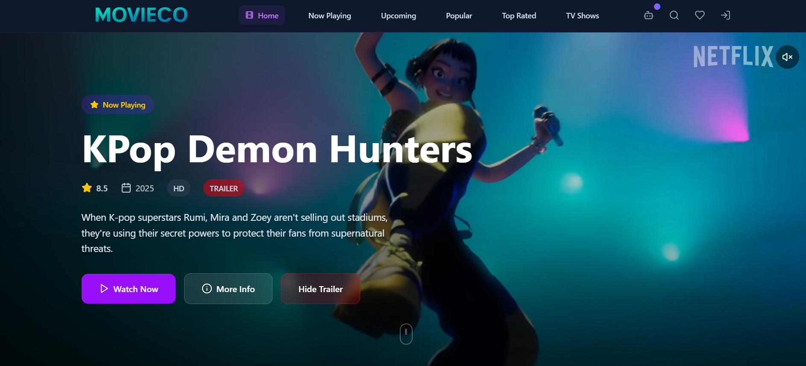
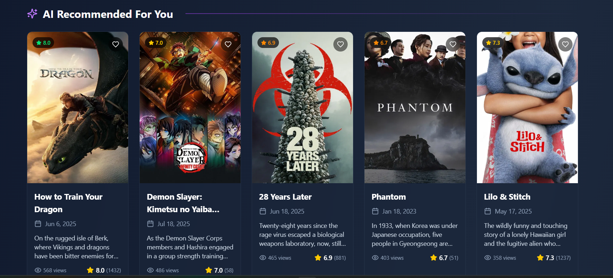
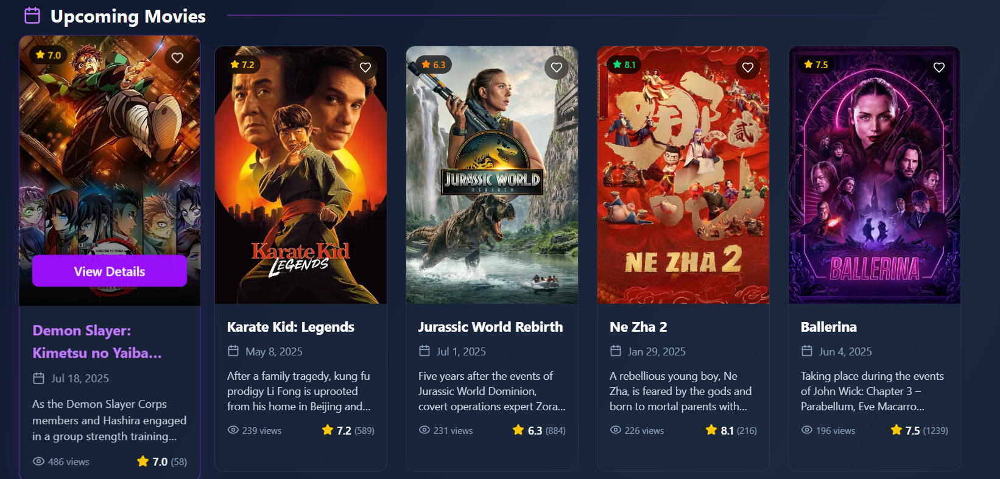
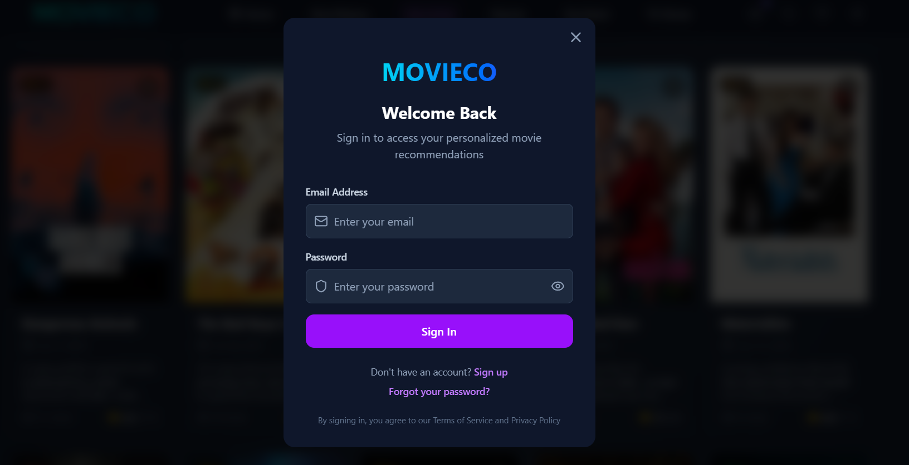

<div align="center">
  
  
  [](https://reactjs.org/)
  [](https://vitejs.dev/)
  [](https://tailwindcss.com/)
  [](https://supabase.com/)
  [](https://openrouter.ai/)
  [](https://www.themoviedb.org/)
  [](LICENSE)
</div>

## 🌟 Overview

**Movieco** is a cutting-edge movie and TV show discovery platform that leverages artificial intelligence to provide personalized recommendations. Built with modern web technologies, it offers an intuitive and engaging experience for movie enthusiasts to discover, track, and manage their entertainment preferences.

### ✨ Key Features

- 🤖 **AI-Powered Recommendations** - OpenRouter AI analyzes your preferences for personalized suggestions
- 🎬 **Comprehensive Database** - Access to thousands of movies and TV shows via TMDB API
- 📺 **TV Shows & Web Series** - Dedicated section for television content
- 🔐 **Secure Authentication** - User accounts with Supabase authentication
- 💾 **Cloud Watchlist** - Synchronized watchlist across all devices
- 🔍 **Advanced Search** - Intelligent search with filters and AI assistance
- 📊 **User Analytics** - Track viewing history and personalized statistics
- 🎨 **Modern UI/UX** - Beautiful, responsive design with smooth animations
- 🌐 **Netflix-Style Grid** - Mobile-optimized grid layout for better browsing experience

### 🤖 AI Features

- **Smart Movie Analysis** - Natural language processing to understand your movie preferences
- **Mood-Based Recommendations** - Find movies based on your current mood (happy, sad, excited, etc.)
- **Genre Intelligence** - Automatically detects and maps genres from your descriptions
- **Cultural Preferences** - Supports recommendations by country and language
- **Time Period Filtering** - Find movies from specific decades or years
- **Rating Intelligence** - Understands quality preferences from natural language
- **Conversational Interface** - Chat naturally about what you want to watch

## 🚀 Live Demo

Experience Movieco live: **[https://movieco-ubb9.vercel.app/](movieco.in)**

## 🛠️ Technology Stack

### Frontend

- **React 18.3.1** - Modern React with hooks and functional components
- **Vite 5.4.2** - Lightning-fast build tool and dev server
- **Tailwind CSS 3.4.1** - Utility-first CSS framework
- **Lucide React** - Beautiful, customizable icons

### Backend & Services

- **Supabase** - Backend-as-a-Service for authentication and database
- **TMDB API** - The Movie Database for comprehensive movie/TV data
- **OpenRouter AI** - Advanced AI router for intelligent movie recommendations

### Database

- **PostgreSQL** (via Supabase) - Robust relational database
- **Row Level Security** - Secure data access patterns

## 🚀 Quick Start

### Prerequisites

- Node.js 18+ and npm/yarn
- TMDB API key
- OpenRouter API key
- Supabase account

### Installation

1. **Clone the repository**

   ```bash
   git clone https://github.com/yourusername/movieco.git
   cd movieco
   ```

2. **Install dependencies**

   ```bash
   npm install
   ```

3. **Set up environment variables**

   ```bash
   cp .env.example .env
   ```

   Fill in your API keys in `.env`:

   ```env
   VITE_TMDB_API_KEY=your_tmdb_api_key_here
   VITE_OPENROUTER_API_KEY=your_openrouter_api_key_here
   VITE_SUPABASE_URL=your_supabase_url_here
   VITE_SUPABASE_ANON_KEY=your_supabase_anon_key_here
   ```

4. **Start the development server**

   ```bash
   npm run dev
   ```

### API Keys Setup

#### TMDB API Key

1. Visit [TMDB](https://www.themoviedb.org/settings/api)
2. Create an account and request an API key
3. Add it to your `.env` file

#### OpenRouter API Key

1. Visit [OpenRouter](https://openrouter.ai/)
2. Sign up and get your API key
3. Add it to your `.env` file
4. The app uses the free `meta-llama/llama-3.2-3b-instruct:free` model by default

#### Supabase Setup

1. Create a project at [Supabase](https://supabase.com/)
2. Get your project URL and anon key
3. Set up the database schema (see `/database` folder)

## 🔧 Configuration

### OpenRouter Models

The app uses `meta-llama/llama-3.2-3b-instruct:free` by default, but you can change it in `src/config/api.js`:

```javascript
export const OPENROUTER_MODEL = "meta-llama/llama-3.2-3b-instruct:free"; // Free model
// Or use other models like:
// export const OPENROUTER_MODEL = "openai/gpt-3.5-turbo"; // Paid model
// export const OPENROUTER_MODEL = "anthropic/claude-3-haiku"; // Paid model
```

### Available Free Models on OpenRouter

- `meta-llama/llama-3.2-3b-instruct:free`
- `meta-llama/llama-3.2-1b-instruct:free`
- `google/gemma-2-9b-it:free`
- `microsoft/phi-3-mini-128k-instruct:free`

## 🐛 Troubleshooting

### Common Issues

1. **OpenRouter API Errors**
   - Ensure your API key is valid and has credits
   - Check if the model is available and not rate-limited
   - Verify the HTTP-Referer header is set correctly

2. **TMDB API Issues**
   - Verify your TMDB API key is active
   - Check rate limits (40 requests per 10 seconds)

3. **Supabase Connection Issues**
   - Ensure your Supabase URL and anon key are correct
   - Check if your database schema is properly set up

## 🔄 Migration from Gemini

If you're upgrading from a previous version that used Gemini AI, see our [Migration Guide](movieco/MIGRATION.md) for step-by-step instructions.

## 📱 Screenshots

<div align="center">
  
  
   
    
</div>
